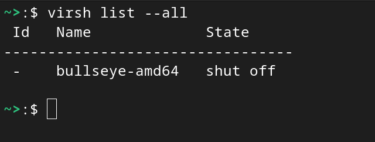
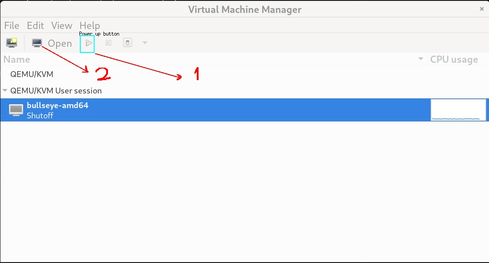

###  KVM ( Kernel Virtual Machine )


Kernel Virtual Machine or KVM is a virtualization solution for for linux, it contains loadable kernel
module kvm.ko , which provides the core virtualization infrastructure and a processor specific module 
kvm-intel.ko, or kvm-amd.ko.

1. Installation 

    1.1. Install Qemu ( Quick Emulator) & Libvirt


    ```
    sudo apt install --no-install-recommends qemu-system libvirt-clients libvirt-daemon-system
    ```


    *qemu-system:* qemu (Quick Emulator) type 2 hypervisor & os emulator

    *libvirt-clients:*  c toolkit to interact with kvm virtualization , it contains tools like libvirt, virsh and other client tools 

    *libvirt-daemon-system:* contains the configuration files to run the libvirt daemon as a system service

    1.2. Install virtinst & virt-manager , virt-viewer

    ```
    sudo apt update && sudo apt install virtinst virt-manager
    ```

    virtinst: command line utilities to create and edit virtual machines , like virt-install

    virt-manager: virt-manager application is a GUI for managing virtual machines through libvirt

    virt-viewer: display the graphical console of the vm.


2. Add user to libvirt group.

    to manage virtual machines as a regular user , add user to libvirt group

    ```
    sudo adduser <user-name> libvirt
    ```


    test ,  to list virtual m/c  ( called domains )

    ```
    virsh list --all
    ```

    Below Sample output 

    

3. User Vs System vm's

    by default virsh run as normal user connects to libvirt using qemu:///session string , this will list only vm's belong to this user 

    to list system vm's  use 

    qemu:///system  connect string

    ```
    virsh --connect qemu:///system list --all
    ```


4. creating simple vm using virtinst.

    ```
    virt-install --virt-type kvm --name bullseye-amd64 \
    --location http://deb.debian.org/debian/dists/bullseye/main/installer-amd64/ \
    --os-variant debian11 \
    --disk size=10 --memory 1000 \
    --graphics none \
    --console pty,target_type=serial \
    --extra-args "console=ttyS0"
    ```

    above command will create a debian11 vm 
    
    --name : name of the vm
    --virt-type : type of vm
    --os-variant   :  debian11
    --disk size=10 
    --memory 1000MB 
    --graphics none:  no graphics at install time

    --console pty,target_type=serial  
    --extra-args "console=ttyS0"   : opens serial port for installation messages to show on terminal

    instead of using local image it downloads and installs from  --location


5. Using virt-manager to connect to vm

    Launch Virtual Machine Manager gui 

    

    select vm and click power on virtual machine button.(1)

    and then  click on Open (2)

    Sample VM Login screen

    


